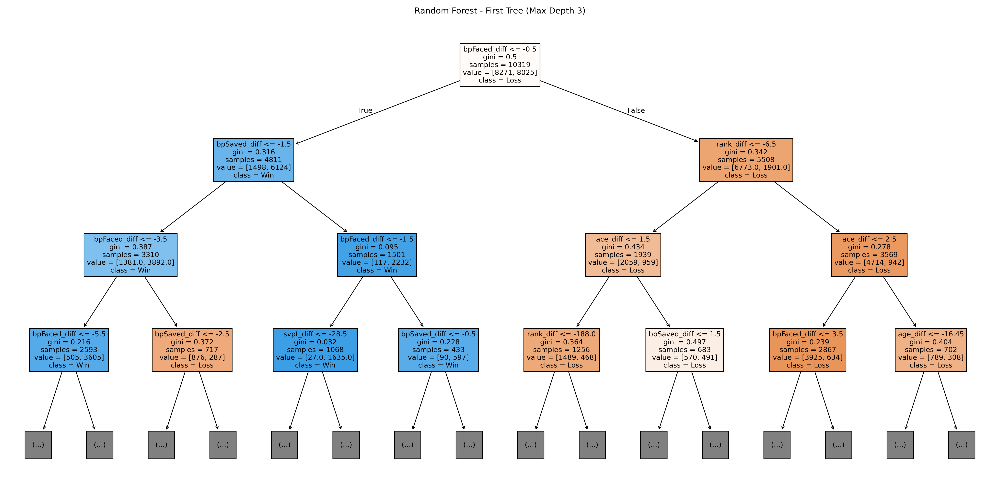
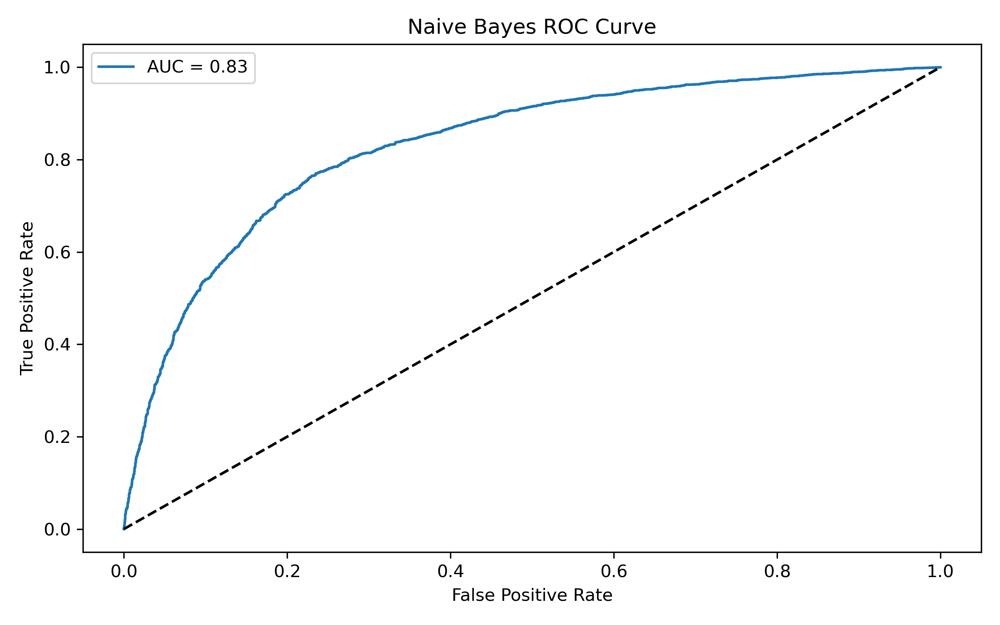
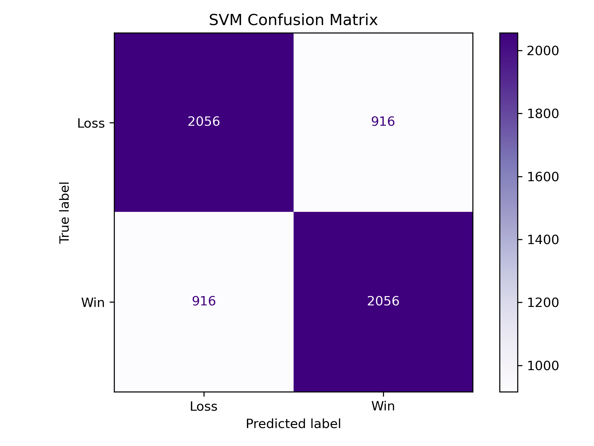
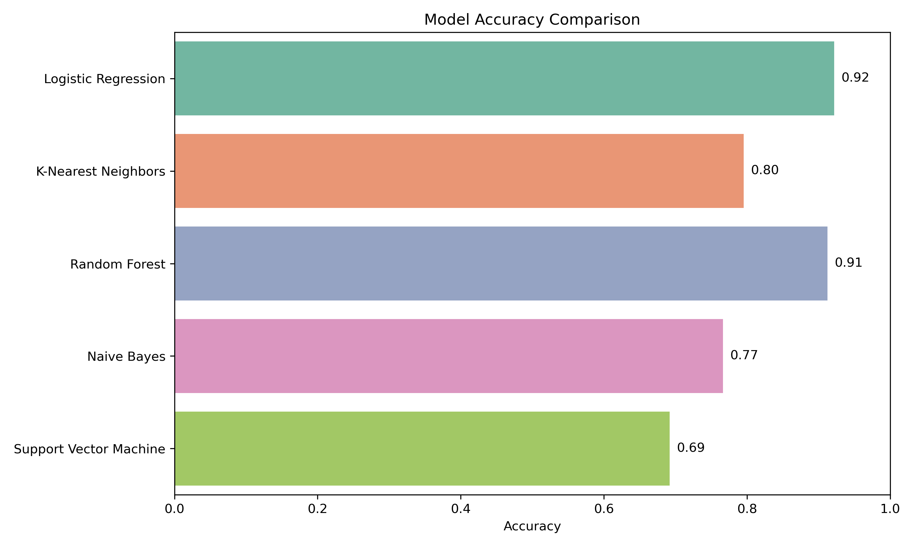

# Predicting Wimbledon 2025 Winner

## Summary
This project uses ATP match outcome data from 2021-2024 to build and evaluate 
machine learning models to predict the winner of the 2025 Wimbledon Tennis 
Tournament. This includes ATP (men's) matches with a variety of machine 
learning models to evaluate performance.

## Input data
Raw CSV files of ATP match outcomes for the 2021-2024 seasons.
    -   'atp_matches_2021.csv'
    -   'atp_matches_2022.csv'
    -   'atp_matches_2023.csv'
    -   'atp_matches_2024.csv'
    
## Objective
The goal is to predict match outcome using match features like:
    -   Ranking difference
    -   Age difference
    -   Match statistics(i.e. aces, break points, etc.)
    -   Surface type(grass, hard, clay)
    
## Scripts
This analysis uses two scripts 'load_and_clean.py' and 'models.py'

### 'load_and_clean.py'
This script begings by defining the function 'process_year()'. This function 
creates columns that calculates the difference in the competing players' match 
statistics (i.e. rank_diff, ace_diff, etc). Addtionally, it creates a dummy 
variable for the surface type, drops the features we aren't interested in, 
and creates the 'target' column which is what the models will be trained to 
find. Lastly, this function creates a flipped model which doubles our amount 
of data while not only telling us why 'Player_A' wins but why 'Player_B' loses.

The script then defines the function 'load_and_clean_data()'. This function 
loads all of the raw csv files and runs them through the process_year() 
function. It then combines all of the dataframes and sets 2021-2023 seasons as 
training data and 2024 as the testing data.

### 'models.py'
This script runs through all of the models: logistic regression, 
k-nearest-neighbors, random forest, naive-bayes, and support vector machine.

#### Logistic Regression

A logistic regression model is a binary classification model that fits outputs 
between 0 and 1 and classifies wins and losses. The model had a 92% accuracy
in predicting match outcomes.
 
#### K-Nearest-Neighors

K-Nearest-Neighbors uses a new data point and finds the 'k' nearest points in 
the training set. From there, it classifies based on majority grouping. This 
model iterates over different values of 'k' to find the most accurate model. 
For this script, the most accurate 'k' was 15 and the accuracy was 80%.

#### Random Forest

Random forest uses many decision trees on different subsets of features and 
then averages the values. The model has 91% accuracy.

#### Naive Bayes

This model is based on Bayes Theorem. It assumes feature independence and uses 
probability distribution to predict wins and losses. The accuracy for this 
model was 77%.

#### Support Vector Machine

This models finds the most optimal plane to seperate wins and losses bases on 
players stats. The accuracy for this model is 69%.

## Results

The model with the best accuracy is the logistic regression.

## Limitations

I had trouble finding womens' data that I could use the same models with.

